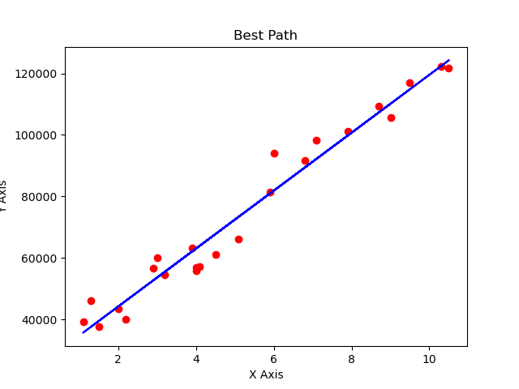
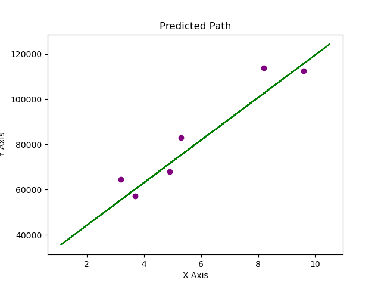
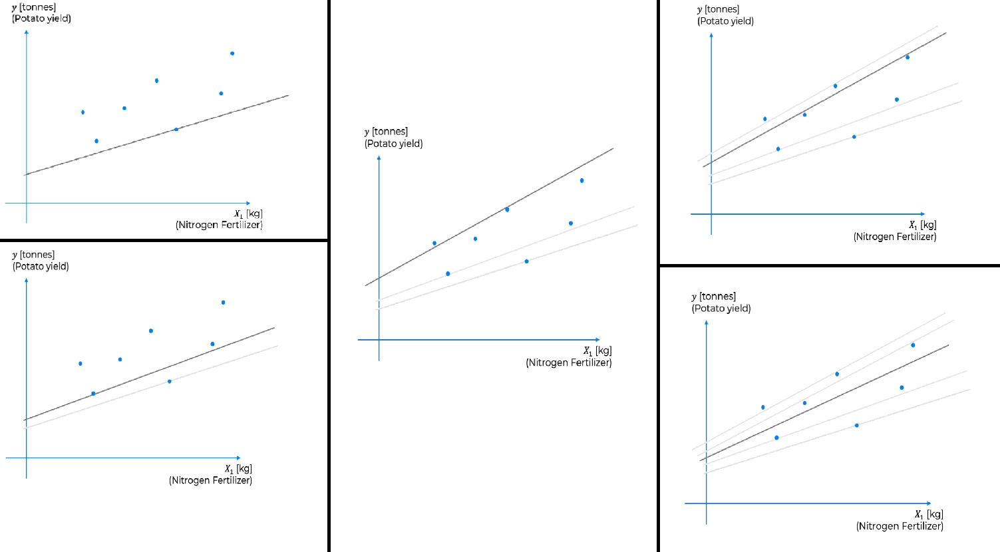
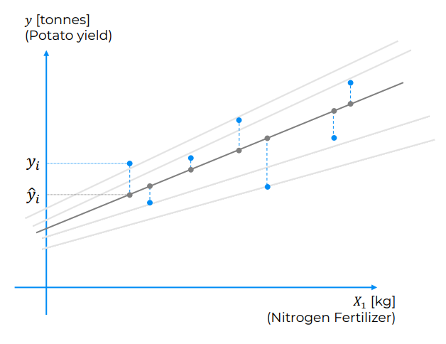
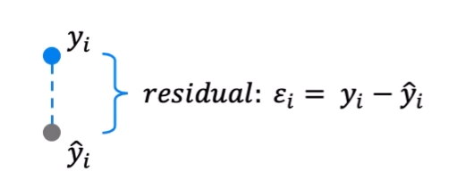

# Regression

## Table Of Contents

## Linear Regression

```python
X = [3, 7, 13, 15]
y = [0.5, 1.2, 1.9, 2.1]

b0 =
b1 =
e =
```

#### Linear Regression Theory

Linear regression is a statistical modeling technique used to establish a relationship between a dependent variable and one or more independent variables. It aims to find the best-fitting linear equation that predicts the value of the dependent variable based on the given independent variables.

In linear regression, the dependent variable is represented as a linear combination of the independent variables, where each independent variable is multiplied by a coefficient (slope) and summed together. The equation for a simple linear regression with one independent variable can be expressed as:

```r
Y = β0 + β1*X + ε
```

Here, `Y` represents the dependent variable, `X` represents the independent variable, `β0` is the intercept (the value of Y when X is 0), `β1` is the slope (the change in Y for a unit change in X), and `ε` represents the error term, which captures the unexplained variation in Y.

The main goal of linear regression is to estimate the values of the `coefficients (β0 and β1)` that minimize the sum of squared differences between the predicted values and the actual values of the dependent variable. This is often done using the method of least squares, where the regression line is fitted to minimize the sum of the squared residuals (the differences between the predicted and actual values).

Linear regression can be used for both simple regression, with one independent variable, and multiple regression, with two or more independent variables. In multiple regression, the equation expands to include additional independent variables and corresponding coefficients.

The assumptions underlying linear regression include:

1. **Linearity:** There should be a linear relationship between the independent variables and the dependent variable.

2. **Independence:** The observations should be independent of each other, meaning that the value of one observation does not influence the value of another.

3. **Homoscedasticity:** The variance of the errors should be constant across all levels of the independent variables. In other words, the spread of the residuals should be consistent.

4. **Normality:** The errors should follow a normal distribution, with a mean of zero.

5. **No multicollinearity:** The independent variables should not be highly correlated with each other, as this can lead to unreliable coefficient estimates.

Linear regression has several applications in various fields, including economics, finance, social sciences, and engineering. It is often used for prediction and forecasting, as well as for understanding the relationship between variables and making inferences.

Extensions of linear regression include polynomial regression, where higher-order polynomial terms are included, and multiple regression with interactions, where the interaction effects between independent variables are considered.

It's worth noting that linear regression has its limitations. It assumes a linear relationship between the variables, which may not always hold in real-world scenarios. Additionally, linear regression is sensitive to outliers and can be affected by influential data points. In such cases, more advanced regression techniques or data transformations may be necessary.

Here is a theoretical code demonstration of the math involved with a linear regression:

```python
import numpy as np

X = np.array([2, 4, 6, 8, 10])
y = np.array([5, 10, 15, 20, 25])

# Calculate the means
X_mean = np.mean(X)
y_mean = np.mean(y)

# Calculate the differences from the means
X_diff = X - X_mean
y_diff = y - y_mean

# Calculate the slope coefficient (β1)
numerator = np.sum(X_diff * y_diff)
denominator = np.sum(X_diff ** 2)
b1 = numerator / denominator

# Calculate the y-intercept (β0)
b0 = y_mean - b1 * X_mean

print("The slope coefficient (β1) is:", b1)
print("The y-intercept (β0) is:", b0)

# Use the resulting linear regression to predict the outcome for new unseen data

X_test = 42
y_predicted = b0 + b1 * X_test

print("Predicted y for X =", X_test, "is:", y_predicted)
```

#### Simple Linear Regression

The process of Linear Regression involves the following steps:

1. **Data Collection**: Gather a dataset containing observations of the dependent variable and corresponding values of the independent variables.

2. **Data Preparation**: Clean the dataset by handling missing values, outliers, and any other data quality issues. Perform data preprocessing steps such as feature scaling or normalization if necessary.

3. **Model Training**: Split the dataset into a training set and a test set. The training set is used to train the Linear Regression model. During training, the model estimates the coefficients (slope and intercept) of the linear equation that best represents the relationship between the independent variables and the dependent variable. The most common method for estimating the coefficients is called Ordinary Least Squares (OLS).

4. **Model Evaluation**: Evaluate the performance of the trained model using the test set. Common evaluation metrics for Linear Regression include mean squared error (MSE), root mean squared error (RMSE), mean absolute error (MAE), and coefficient of determination (R-squared). These metrics provide insights into how well the model fits the data and makes predictions.

5. **Model Deployment**: Once the model has been trained and evaluated, it can be used to make predictions on new, unseen data. The trained Linear Regression model can be integrated into a production system or used for further analysis and decision-making.

Now, let's move on to the code examples.

###### Code Example 1: Simple Linear Regression using 3rd-party Libraries (Python)

```python
import numpy as np
from sklearn.linear_model import LinearRegression

# Sample dataset
X = np.array([[1], [2], [3], [4], [5]])  # Independent variable
y = np.array([2, 4, 6, 8, 10])  # Dependent variable

# Create a Linear Regression model
model = LinearRegression()

# Train the model
model.fit(X, y)

# Predict the values for new X
new_X = np.array([[6], [7], [8], [9], [10]])
predicted_y = model.predict(new_X)

# Print the predicted values
print(predicted_y)
```

In this example, we use the `LinearRegression` class from the scikit-learn library to perform Linear Regression. We create a model object, fit the model to the data, and then use it to predict the values for new `X` using the `predict` method.

###### Code Example 2: Low-level Linear Regression Implementation (Python)

```python
import numpy as np

# Sample dataset
X = np.array([[1], [2], [3], [4], [5]])  # Independent variable
y = np.array([2, 4, 6, 8, 10])  # Dependent variable

# Add a column of ones to X for the intercept term
X = np.concatenate((np.ones((X.shape[0], 1)), X), axis=1)

# Calculate the coefficients using Ordinary Least Squares (OLS)
coefficients = np.linalg.inv(X.T @ X) @ X.T @ y

# Extract the intercept and slope
intercept = coefficients[0]
slope = coefficients[1]

# Predict the values for new X

new_X = np.array([[6], [7], [8], [9], [10]])
new_X = np.concatenate((np.ones((new_X.shape[0], 1)), new_X), axis=1)
predicted_y = new_X @ coefficients

# Print the predicted values
print(predicted_y)
```

In this low-level code example, we perform Linear Regression by directly calculating the coefficients using Ordinary Least Squares (OLS). We first add a column of ones to the independent variable `X` to account for the intercept term. Then, we use the formula `coefficients = (X^T * X)^-1 * X^T * y` to calculate the coefficients. Finally, we predict the values for new `X` by multiplying it with the coefficients.
In the line `coefficients = np.linalg.inv(X.T @ X) @ X.T @ y`, the `@` symbol represents the matrix multiplication operator in Python. It was introduced in Python 3.5 as the infix operator for matrix multiplication.

In the equation, `X` represents the matrix of independent variables (including a column of ones for the intercept term), `y` represents the vector of dependent variable values, `@` denotes matrix multiplication, `X.T` is the transpose of `X`, and `np.linalg.inv()` calculates the inverse of a matrix.

By multiplying the transpose of `X` with `X` and taking its inverse, we obtain the matrix `(X.T @ X)^(-1)`. Then, by multiplying this result with the transpose of X and y, we obtain the coefficients.

This approach is particularly useful when dealing with multiple independent variables and can efficiently solve for the coefficients without the need for iterative optimization algorithms. The `np.linalg.inv()` function from the NumPy library is used to calculate the matrix inverse.

In the context of Linear Regression, the matrix multiplication `X.T @ X` calculates the dot product of the transposed `X` matrix and the original `X` matrix, which is required in the `OLS` formula. Similarly, `X.T @ y` calculates the dot product of the transposed `X` matrix and the `y` vector. The resulting matrices are then multiplied together using `@` to obtain the final coefficient values.

Both examples demonstrate Linear Regression, with the first example utilizing scikit-learn's built-in Linear Regression class for simplicity and convenience, while the second example demonstrates the mathematical implementation of Linear Regression using low-level code.

#### Linear Regression : Intuitive Explanation

Linear Regression is a mathematical function used for describing a linear relationship between a value that depends on other independent variables.
In Machine Learning, it is used to describe the relationship between features and a target - Predictor(s) and a Response variable.
It assumes a linear influence of the features on the target variable - meaning, a "direct", or, continuous effect.

To understand linear regression, imagine a 2D graph with some points scattered on it - and a line that crosses through these points.
In the context of a linear regression setup, that line would describe the best linear path that could traverse through the points, with the closest proximity to
each point as possible:

```python
# Import the dataset
dataset = pd.read_csv('Salary_Data.csv')
X = dataset.iloc[:, :-1].values
y = dataset.iloc[:, -1].values

# Split dataset to train&test sets
X_train, X_test, y_train, y_test = train_test_split(
    X, y, test_size=0.2, random_state=42)

# Create LR class instance, train the model, and make prediction
regressor = LinearRegression()
regressor.fit(X_train, y_train)
y_pred = regressor.predict(X_test)

# Log Coefficients
# *** The initial starting point of the regression line on the Y axis
print("Y-Intercept: ", regressor.intercept_)
# *** The magnitude of change in Y for each 1 unit of X
print("Coefficient: ", regressor.coef_)
```

Once the LinearRegression model is trained, we can plot the training data and see how the regression fits on the graph in relation to it.
This line represents the best linear path that traverses through all the points on the graph - with the least possible error margin when considering all of these training data points together:



```python
# Visualize the "Best Path" for the training data (training set result)
plt.scatter(X_train, y_train, color='red')
plt.plot(X_train, regressor.predict(X_train), color='blue')
plt.xlabel('X Axis')
plt.ylabel('Y Axis')
plt.title('Best Path')
plt.show()
```

Lastly, we would want to see how the regression line would fit with unseen data:



```python
# Visualize how unseen data spreads around the learned Training Path (test set results)

plt.scatter(X_test, y_test, color='purple')
plt.plot(X_train, regressor.predict(X_train), color='green')
plt.xlabel('X Axis')
plt.ylabel('Y Axis')
plt.title('Predicted Path')
plt.show()
```

---

This is the formula for basic linear regression:

```r
Y = β0 + β1*X + ε
```

Each variable here plays a role on influencing the outcome "`Y`", and it is important to understand the role of each of them:

    _ _ _ _ _ _ _ _ _ _ _ _ _ _ _ _ _ _ _ _ _ _ _ _ _ _ _ _ _ _ _ _ _ _ _ _ _ _ _ _ _ _ _ _ _ _ _ _ _ _ _ _ _ _ _ _ _ _ _ _ _ _ _ _ _ _ _ _ _ _ _ _
    #Target Variable                #const Y-Intercept              #Slope-Coefficient              #Independent Variable               #Error Term
          Y               =               β0              +               β1              *               X                   +               ε
    _ _ _ _ _ _ _ _ _ _ _ _ _ _ _ _ _ _ _ _ _ _ _ _ _ _ _ _ _ _ _ _ _ _ _ _ _ _ _ _ _ _ _ _ _ _ _ _ _ _ _ _ _ _ _ _ _ _ _ _ _ _ _ _ _ _ _ _ _ _ _ _

**Y-Intercept**:

The value of the `Y-Intercept` represents the initial point that the regression line starts from. Geometrically, it is the point where the
regression line intersects the y-axis.

The `Y-Intercept` is often denoted as `b` or `β0`, and it is a constant term in the linear regression equation. It represents the predicted value of the
dependent variable when all independent variables are zero (for example, {X = 0, y = 42}).

**Slope Coefficient**:

The value of the `Slope Coefficient` represents the amount of change in the Target Variable, for every integral change (+-1.0) of the Independent Variables,
the `X-Features Matrix`. It quantifies the relationship between `y`, the dependent variable, for a unit change in the independent variable, `X`.
In a simple linear regression model with one independent variable, the slope coefficient is a constant value.

The value of the slope coefficient is estimated based on the data during the model fitting process. It is not predetermined but is determined by finding the
best-fitting line that minimizes the sum of squared differences between the predicted values and the actual values. Each observation in the dataset
contributes to the estimation of the slope coefficient, and it is specific to the particular dataset and model.
(for example,

```python

x = [4, 7, 11, 16]
y = [2, 3, 5, 7]

mean_x = sum(x) / len(x)
mean_y = sum(y) / len(y)

β1_slope_coefficient = sum((xi - mean_x) * (yi - mean_y) for xi, yi in zip(x, y)) / sum((xi - mean_x) ** 2 for xi in x)
```

)

In linear regression, the coefficient, often denoted as `m` or `β1`, represents the slope of the line. The coefficient determines the direction and
magnitude of the relationship between the variables.
In multiple linear regression, there is a coefficient associated with each independent variable.

#### Understanding The Slope Coefficient

Let's say we have a dataset that contains information about houses, including the size of the house in square feet (`X`) and the corresponding
sale prices in dollars (`y`). We want to build a linear regression model to predict the sale price of a house based on its size.

After fitting the linear regression model to the data, we obtain the following equation:

- y = 5000 + 200 \* X

In this equation, the slope coefficient is 200. It indicates that for every one-unit increase in the size of the house, the predicted sale price will
increase by $200. So, if we have two houses with a size difference of 100 square feet, we would expect the predicted sale price of the larger house to
be $20,000 higher than the smaller house.

**For example**:

- House 1: Size = `1500` sq. ft.
- House 2: Size = `1600` sq. ft. `$20,000 Difference`

Using the linear regression equation, we can calculate the predicted sale prices:

Predicted price for House 1:
**`5000 + 200 * 1500 = $305,000`**
Predicted price for House 2:
**`5000 + 200 * 1600 = $325,000`**

The difference in predicted prices is indeed $20,000, reflecting the impact of the slope coefficient.

Remember that the actual values of the slope coefficient and the intercept (5000 in this case) would be determined by the linear regression model based
on the specific dataset used for training. The example above is just a hypothetical illustration to demonstrate the concept.

#### Ordinary Least Squares (OLS)

Ordinary Least Squared is a mathematical function commonly used for minimizing the residuals (error term) across all present data points to find the best Linear Regression line.

To find the best regression line, we need to first consider how can we define what is the best regression line.
There are many regression lines that are potential candidates for the best regression line.
Let's say that we have a dataset that documents a Potatoes Farm harvest. `X` is the amount of Fertilizer used for a harvest, that produced some amount of potatoes measured in Tonnes - which is the `y` outcome.

Even this simple case has many potential regression lines. It could be either one of these lines, and more:



Each one of these potential lines might be the best regression line to describe the **change** happening in the data.
However, there can only be 1 "best" regression line - and to find it, each potential line needs to be measured. The line with the smallest error residuals will be picked as the best line.

For the simplicity of our example, we are using only 1 potential line for illustrative purposes.


The way to imagine how this process works in a visual sense, we need to take our data points and project them vertically onto our linear regression line.

`yi` is the actual amount of potatoes. In our example, potatoes yielded from the farm when that specific amount of nitrogen fertilizer was used. So, let's say 15 kilograms of nitrogen fertilizer were used and the farm yielded two tons of potatoes.

`ȳi`, on the other hand, is what this linear regression that we're considering predicts the yield to be or to would have been.



The difference between `yi` and `ȳi` is the Residual - the Error Term. The lower this value is across all `y` and `ȳ` points (the Sum [∑]), the more likely this line could be considered as the best regression line - and in fact, the best regression line would be the line with the lowest possible residuals.

```r
SSR = Σ(y - ŷ)^2     # Sum Squared Residuals
```

The "best" residuals are obtained when the sum of the squares of the residuals is minimized. We basically measure the error outcome of each line, and minimize them to get back the line with the smallest error possible. for example:

```r
SSR = MIN(Σ(y0 - ŷ0)^2, Σ(y1 - ŷ1)^2, Σ(y2 - ŷ3)^2, ...)
```

---

###### OLS & the Slope Coefficient

In linear regression, the coefficients (including the slope coefficient) are estimated through a process called "ordinary least squares" (OLS) estimation. The goal of OLS estimation is to find the best-fitting line that minimizes the sum of squared residuals, which are the differences between the observed values and the predicted values.

The OLS method or other appropriate techniques are used to estimate the coefficients accurately in linear regression models.

The values of the coefficients, including the slope coefficient, are estimated based on the data during the model fitting process using the OLS method. The OLS method calculates the coefficients by minimizing the sum of squared residuals. Each observation in the dataset contributes to the estimation of the coefficients.

The estimation process involves finding the values of the coefficients (often denoted as `β1`, `β2`, `β3`, etc...) that minimize the sum of squared differences between the observed values of the dependent variable and the predicted values from the linear regression model.

The OLS estimation algorithm takes into account all the data points and iteratively adjusts the coefficients until it finds the values that result in the smallest sum of squared residuals. This estimation process ensures that the linear regression model captures the overall relationship between the independent variable(s) and the dependent variable in the best possible way.

The formula to estimate the slope coefficient (`β1`) in linear regression is:

```r
β1 = ∑((xi - x̄)(yi - ȳ)) / ∑((xi - x̄)^2)
```

Where:

- `xi` represents the individual values of the independent variable.
- `x̄` represents the mean of the independent variable.
- `yi` represents the individual values of the dependent variable.
- `ȳ` represents the mean of the dependent variable.

The numerator of the formula calculates the sum of the products of the differences between each independent variable value (xi) and its mean (x̄) and the corresponding differences between each dependent variable value (yi) and its mean (ȳ).
The denominator of the formula calculates the sum of the squared differences between each independent variable value (xi) and its mean (x̄).

By dividing the numerator by the denominator, the formula estimates the slope coefficient, representing the change in the dependent variable for every unit change in the independent variable.

It's important to note that the formula provided assumes a simple linear regression model with one independent variable. In multiple linear regression with multiple independent variables, the estimation of the slope coefficients involves more complex calculations using matrix operations.

---

###### OLS & the Residuals

In ordinary least squares (OLS) estimation, the primary objective is to estimate the coefficients (including the slope coefficient) that best fit the given data by minimizing the sum of squared residuals. The process involves finding the values of the coefficients that result in the smallest difference between the observed values of the dependent variable and the predicted values from the regression model.

The estimation of coefficients in OLS is achieved by minimizing the sum of squared residuals, which are the differences between the observed values (y) and the predicted values (ŷ) obtained using the regression equation:

```r
# predicted y
ŷ = β0 + β1x1 + β2x2 + ... + βnxn
```

Here, '`β0`, `β1`, `β2`, `...`, `βn`' are the coefficients to be estimated, and '`x1`, `x2`, `...`, `xn`' are the independent variables. The sum of squared residuals is given by:

```r
SSR = Σ(y - ŷ)^2     # Sum Squared Residuals
```

To find the optimal coefficients that minimize `SSR`, OLS estimation employs mathematical techniques such as calculus and linear algebra. By taking the derivative of `SSR` with respect to each coefficient and setting them to zero, we can solve a system of equations known as the normal equations. These equations provide the values of the coefficients that minimize `SSR`, and the resulting regression model represents the best-fit line or hyperplane.

Therefore, through OLS estimation, we simultaneously estimate all the coefficients in the regression model, including the slope coefficient. The residuals, which are the differences between the observed values and the predicted values, are used to evaluate the goodness of fit of the regression model and assess its accuracy in capturing the relationship between the independent and dependent variables.

The "best" residuals are obtained when the sum of the squares of the residuals is minimized. This concept is a fundamental principle in the ordinary least squares (OLS) estimation method used in linear regression.

Residuals in linear regression represent the differences between the observed values of the dependent variable and the predicted values from the linear regression model. The goal of the OLS estimation is to find the line that minimizes the overall discrepancy between the observed values and the predicted values.

By minimizing the sum of the squares of the residuals (often referred to as the "sum of squared residuals" or "residual sum of squares"), the OLS estimation method ensures that the linear regression model provides the best fit to the data. This approach emphasizes reducing the squared differences rather than absolute differences, giving more weight to larger residuals and effectively penalizing them.

Minimizing the sum of the squares of the residuals leads to a line that optimally captures the linear relationship between the independent variable(s) and the dependent variable. This line represents the best approximation of the true underlying relationship, providing the most accurate predictions and the best overall fit to the data.

Therefore, the objective of OLS estimation is to find the coefficients (slope and intercept) that minimize the sum of the squares of the residuals, making it a widely used and effective method in linear regression analysis.

In summary, OLS estimation considers both the coefficients and the residuals. The goal is to find the coefficients that minimize the sum of squared residuals, indicating the best fit between the model and the observed data.

## Multiple Linear Regression
